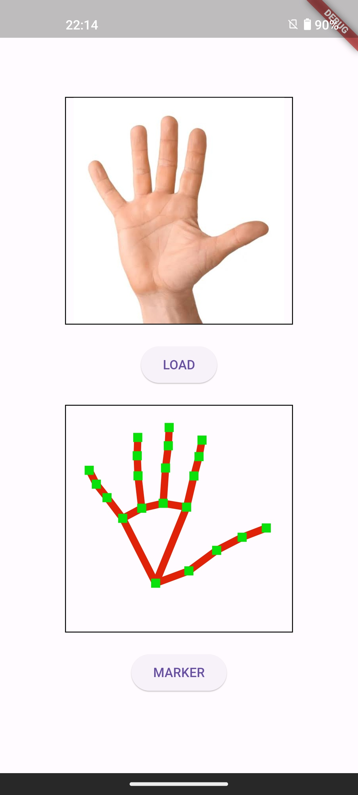
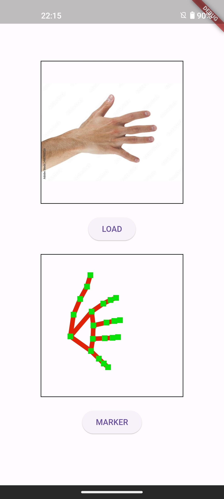

[](https://choosealicense.com/licenses/mit/)

# Flutter Hand Land Marker

The MediaPipe Hand Landmarker task lets you detect the landmarks of the hands in an image. These instructions show you how to use the Hand Landmarker with Android apps.

You can use the app as a starting point for your own Android app, or refer to it when modifying an existing app

## Screenshots




## Dependencies

minSdkVersion 24

build.gradle

```gradle
    plugins {
        id 'de.undercouch.download'
        ...
    }

    ...

    project.ext.ASSET_DIR = projectDir.toString() + '/src/main/assets'
    apply from: 'download_tasks.gradle'

    dependencies {
        implementation 'com.google.mediapipe:tasks-vision:0.20230731'
    }
```

```gradle
task downloadTaskFile(type: Download) {
    src 'https://storage.googleapis.com/mediapipe-models/hand_landmarker/hand_landmarker/float16/1/hand_landmarker.task'
    dest project.ext.ASSET_DIR + '/hand_landmarker.task'
    overwrite false
}

```

## Autor

- [@ayusuke7](https://github.com/ayusuke7)
